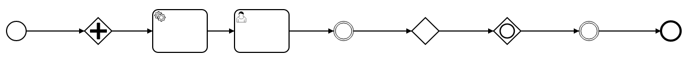

# bpmn-js-cli-modeling-dsl

[](https://travis-ci.org/nikku/bpmn-js-cli-modeling-dsl)

A modeling DSL (domain specific language) for [bpmn-js](https://github.com/bpmn-io/bpmn-js), built on top of [bpmn-js-cli](https://github.com/bpmn-io/bpmn-js-cli).


## Usage

Use the extension for [bpmn-js-cli](https://github.com/bpmn-io/bpmn-js-cli) to quickly model simple processes.

To model this process:



simply execut the following command

```
cli.model('StartEvent_1 -> and -> service -> user -> icatch -> xor -> or -> ithrow -> end');
```

You may use the full classified name of any BPMN element such as `bpmn:ServiceTask`, too to model it.


### Shortcuts

A number of aliases are registered for most commonly modeled BPMN elements:

```
var aliases = {
  service:     'bpmn:ServiceTask',
  user:        'bpmn:UserTask',
  manual:      'bpmn:ManualTask',
  task:        'bpmn:Task',
  end:         'bpmn:EndEvent',
  transaction: 'bpmn:Transaction',
  sub:         'bpmn:SubProcess',
  call:        'bpmn:CallActivity',
  icatch:      'bpmn:IntermediateCatchEvent',
  ithrow:      'bpmn:IntermediateThrowEvent',
  xor:         'bpmn:ExclusiveGateway',
  or:          'bpmn:InclusiveGateway',
  and:         'bpmn:ParallelGateway'
};
```

Use any of the aliases instead of the full qualified BPMN name.


## Setup

Deploy the cli-extension with [bpmn-js](https://github.com/bpmn-io/bpmn-js):

```
var BpmnModeler = require('bpmn-js/lib/Modeler'),
    ModelingDslModule = require('bpmn-js-cli-modeling-dsl');

var modeler = new BpmnModeler({
  container: document.body,
  additionalModules: [ ModelingDslModule ],
  cli: { bindTo: 'cli' }
});

modeler.importXML('some-bpmn-xml');
```


Access the cli as `cli` in your developer console (open via `F12` in most browsers).

Create a simple process from `<start>` via

```
cli.model('<start> -> and -> service -> user -> icatch -> xor -> or -> ithrow -> end');
```


## License

MIT